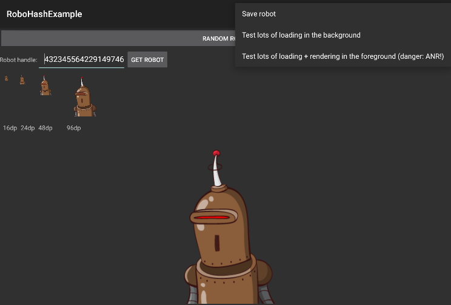

Example for android-robohash
==============================

This is an example application that shows the usage of the [`android-robohash`](https://github.com/neuhalje/android-robohash) library.

Installation
---------------
Clone & `./gradlew installDebug`.

### Alternatively link to AAR source project

* Clone the repository besides `android-robohash`,
* copy `settings.gradle.tpl`  to `settings.gradle`,
* and modify the dependencies in `build.gradle` to `compile project("..:android-robohash")`.

LICENSE
-----------

[WTFPL](http://www.wtfpl.net/about/)
